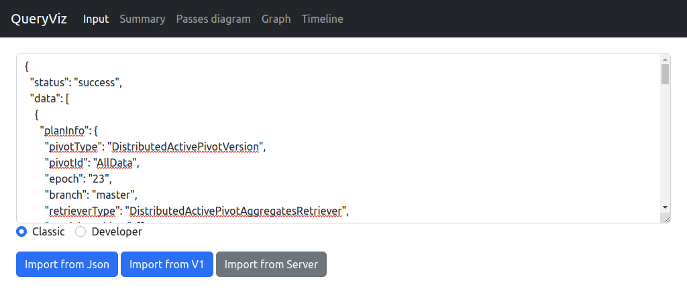
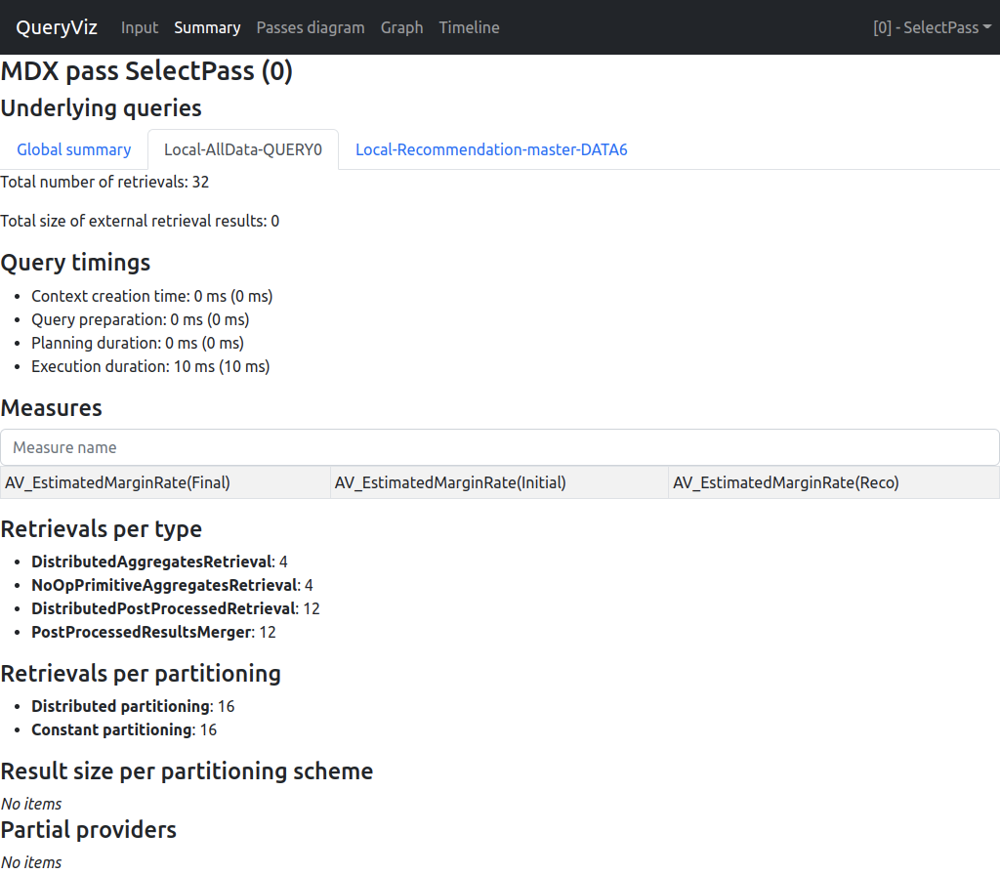
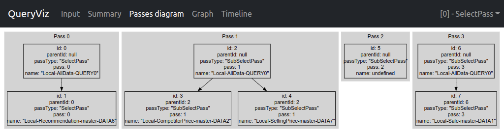
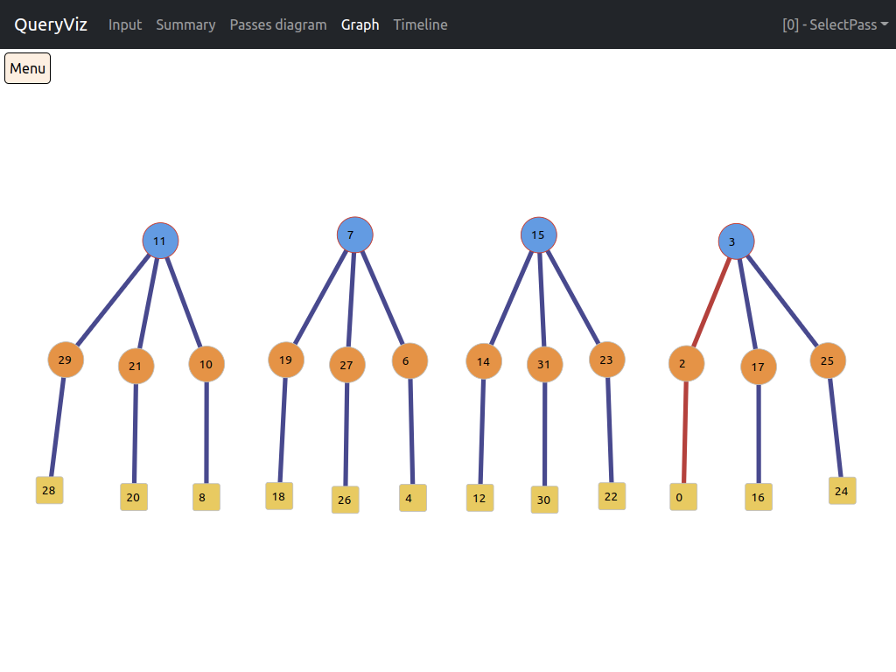
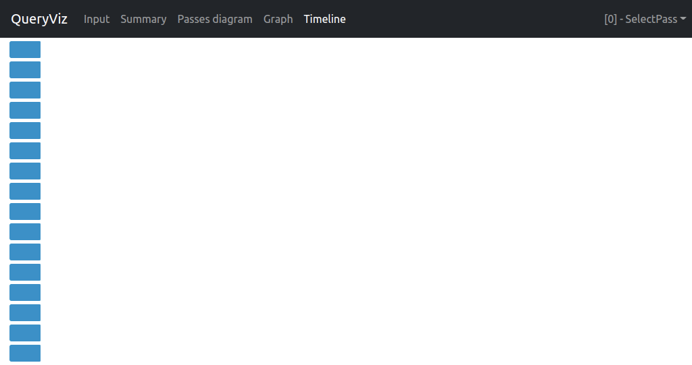
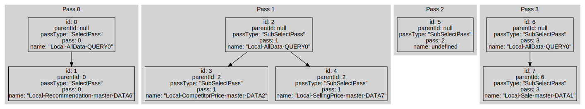

# Atoti Query Analyzer

## Application Overview

This application is used to analyze query execution plan reports. It can consume data in format of ActivePivot logs (referred to as V1) and in form of JSON.

Application has 5 sections: **Input**, **Summary**, **Passes diagram**, **Graph**, **Timeline**.

**Input** is used for consuming plan reports:

**Summary** shows statistics on queries (e.g. execution time, measures, count of retrievals by type etc.):

**Passes diagram** shows info about passes and dependencies between queries.

**Graph** shows retrievals executed within a query, as well as dependencies between them:

**Timeline** represents execution time of retrievals:

## Data model

Input data is organized in form of list of _query plans_. Inside the query analyzer, query plans are represented by
interface `QueryPlan`, which corresponds to the class `com.quartetfs.biz.pivot.query.aggregates.IQueryPlan` in 
ActivePivot. 

Queries may be executed within one or several _passes_. Each query belongs to one pass. Each pass has one _root query_,
which optionally depends on other queries from this pass. In their turn, these queries may also have dependencies,
and so on. Dependencies can ber represented as a tree diagram:

List of processed query plans is stored in `queryPlans` state variable of the `App` component.
Relations between queries (tree structure and pass info) are stored in `queryMetadata` state variable.

Each query has a set of retrievals. Some of them depend on others. Graph of retrievals is stored as a `RetrievalGraph`.

## Project structure

* `cypress`: tests
* `media`: assets for documentation
* `public`: static assets of the web application
* `src`: source code
    * `components`: React components
        * `Details`: component for showing retrieval info
        * `ErrorBoundary`: technical component for catching react rendering-time errors
        * `Graph`: component for graph drawing
        * `Input`: component for input consuming
        * `NavBar`: component for navigation panel
        * `Notification`: technical component for showing notifications
        * `PassGraph`: component for showing info on passes and query dependencies
        * `Summary`: component for showing query summary
        * `Timeline`: component for showing timeline
    * `hooks`: react hooks (mechanism for indirect communication between components and arbitrary js code)
    * `library`: React-free part of code
        * `dataStructures`: data structures used in this project
            * `common`: reusable containers and algorithms
            * `d3`: interfaces for communication with d3.js
            * `json`: interfaces and functions for parsing and validating raw json
            * `processing`: interfaces and functions for building handy internal data representation
        * `devTools`: utilities for making debugging easier
        * `graphProcessors`: tools for processing query plans
        * `graphView`: tools for graph visualization
        * `inputProcessors`: tools for input parsing and processing
        * `utilities`: helper functions

## Project configuration

### ESLint configuration

#### Plugins
* `jsx-a11y`: Static AST checker for accessibility rules on JSX elements.
* `prettier`: Integration with Prettier formatter.
* `@typescript-eslint/eslint-plugin`: Support for TypeScript.
* `import`: Provides linting for `import`/`export`.
* `jsdoc`, `tsdoc`: Support for JSDoc and TSDoc, respectively.

#### Rules

As a basic set of rules, `airbnb-typescript` was chosen. This choice looks quite reasonable.
Some extra rules were added:
* `jsdoc/require-jsdoc`: enforce JSDoc comments on public (exported) classes and functions.
* `tsdoc/syntax`: checks consistency with TSDoc syntax (TODO do we really need it? Seems to be buggy).
* `semi`: enforce semicolons.
* `no-param-reassign`: prohibit function argument reassignment.
* `react/jsx-filename-extension`: prohibit JSX in `.js` files.
* `prettier/prettier`: config for Prettier.

### TypeScript project configuration

This config is mostly autogenerated...

### Available Scripts

This project was bootstrapped with [Create React App](https://github.com/facebook/create-react-app).

In the project directory, you can run:

#### `npm start`

Runs the app in the development mode. 
Open [http://localhost:3000](http://localhost:3000) to view it in the browser.

The page will reload if you make edits. 
You will also see any lint errors in the console.

#### `npm test`

Launches the test runner in the interactive watch mode. 
See the section about [running tests](https://facebook.github.io/create-react-app/docs/running-tests) for more information.

#### `npm run build`

Builds the app for production to the `build` folder. 
It correctly bundles React in production mode and optimizes the build for the best performance.

The build is minified and the filenames include the hashes. 
Your app is ready to be deployed!

See the section about [deployment](https://facebook.github.io/create-react-app/docs/deployment) for more information.

#### `npm run eject`

**Note: this is a one-way operation. Once you `eject`, you can’t go back!**

If you aren’t satisfied with the build tool and configuration choices, you can `eject` at any time. This command will remove the single build dependency from your project.

Instead, it will copy all the configuration files and the transitive dependencies (Webpack, Babel, ESLint, etc.) right into your project, so you have full control over them. All the commands except `eject` will still work, but they will point to the copied scripts, so you can tweak them. At this point you’re on your own.

You don’t have to ever use `eject`. The curated feature set is suitable for small and middle deployments, and you shouldn't feel obligated to use this feature. However, we understand that this tool wouldn't be useful if you couldn't customize it when you are ready for it.

#### `cypress`

Run tests using the Cypress tool.

#### `eslint`

Run ESLint to find code style and code quality issues.

#### `format-prettier`

Run Prettier formatter.

#### `typedoc`

Build documentation.

#### `typedoc:dev`

Run file watcher and rebuild documentation on every file change.

#### `gen-dts`

Build `.d.ts` files with function declarations for corresponding `.js` files.