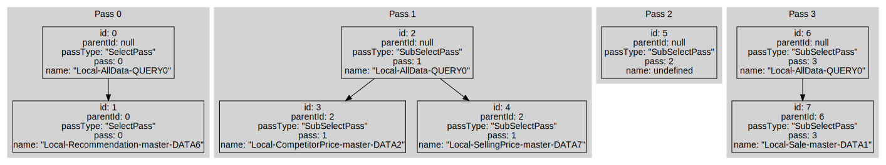

# /concepts 

[Parent directory](../__index__.md)

## Table of contents 
* [dataModel.md](#__autogen_2__)

## Data Model 

The data coming into the program is a list of related _queries_.

Data enters the program either in the form of logs (denoted as V1 format) or in the form of JSON. In addition, data can
be downloaded directly from the server.

Inside the program, all the data is stored as an array `QueryPlan[]`.

Each request belongs to one of the _passes_. Within each pass, requests are organized into a tree.

_Pass diagram_

Data about the structure of trees and passages is stored as an array `QueryPlanMetadata[]`.
